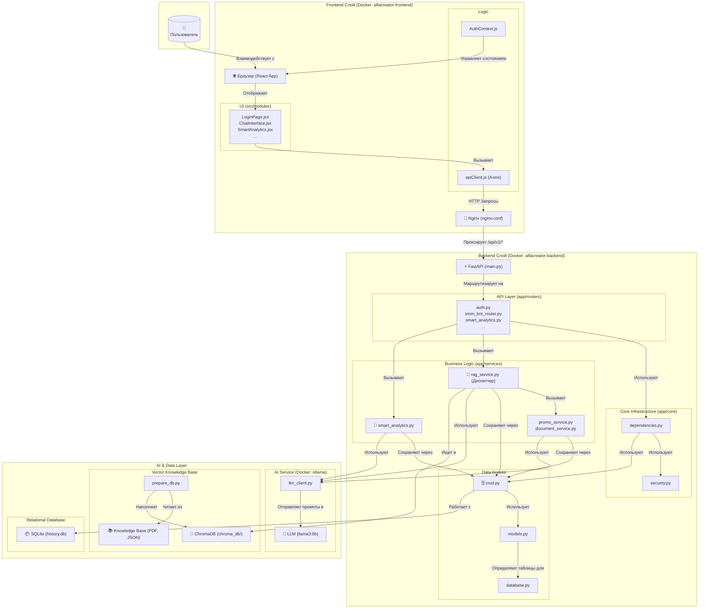

# Альфа-Креатор: Интеллектуальный AI-помощник для малого бизнеса

**Альфа-Креатор** — это комплексная full-stack веб-платформа, разработанная для автоматизации и упрощения маркетинговых и операционных задач малого бизнеса. Приложение использует мощь локально развернутых больших языковых моделей (LLM) для предоставления умных, контекстно-зависимых решений, выступая в роли персонального ассистента для предпринимателя.

## 🎯 О проекте

Современный малый бизнес сталкивается с необходимостью постоянно создавать контент для социальных сетей, вести документооборот и анализировать продажи, не имея при этом больших бюджетов и штата сотрудников.

**Альфа-Креатор** решает эту проблему, предоставляя единый интуитивно понятный интерфейс для:
- **Генерации** креативных промо-материалов.
- **Автоматического создания** юридически значимых документов.
- **Получения экспертных консультаций** по SMM на основе специализированной базы знаний.
- **Проведения интеллектуального анализа** данных о продажах.
- **Формирования стратегического контент-плана** на неделю с учетом актуальных трендов.

Ключевой особенностью проекта является использование **RAG (Retrieval-Augmented Generation)**, что позволяет AI-ассистенту давать ответы не на основе общих знаний из интернета, а на базе загруженных в систему экспертных материалов (книг, статей, регламентов), превращая его в узкоспециализированного консультанта.

## ✨ Ключевые возможности
- **👑 SmartAnalytics — Стратегический SMM-планировщик:** AI анализирует бизнес пользователя (ссылка на соцсеть или файл) и актуальные тренды, после чего генерирует готовый контент-план на неделю с темами, идеями для постов, форматами и призывами к действию.
- **🤖 Интеллектуальный AI-Ассистент (Чат-бот)**: Центральный элемент системы. Понимает запросы на естественном языке и самостоятельно выбирает нужный инструмент для выполнения задачи. Оснащен "конвейером проверок" для отсеивания некорректных запросов.

- **✍️ Генератор промо-материалов**: Создает три уникальных рекламных поста на основе описания продукта, целевой аудитории и желаемой тональности.

- **📄 Генератор документов**: Автоматически формирует текстовое содержимое для документов по готовым шаблонам:
  - Счет на оплату (`invoice`)
  - Договор на оказание услуг (`service_contract`)
  - Акт выполненных работ (`completion_act`)

- **📊 Аналитика продаж**: Пользователь загружает CSV-файл с данными о продажах. Система в фоновом режиме анализирует его, формирует выводы и рекомендации с помощью AI, а также строит визуальный график продаж.

- **🧠 База знаний (RAG)**: Позволяет чат-боту отвечать на сложные теоретические вопросы в области SMM, основываясь на загруженной базе знаний (PDF, JSON файлы).

- **🗂️ История запросов**: Все взаимодействия с AI сохраняются в профиле пользователя, позволяя просматривать и повторно использовать результаты.

- **🔐 Аутентификация**: Безопасная система регистрации и входа пользователей на основе JWT-токенов.

## 🛠️ Стек технологий

| Категория          | Технологии                                                                          |
| ------------------ | ----------------------------------------------------------------------------------- |
| **Бэкенд**         | Python, FastAPI, SQLAlchemy (asyncio), Pydantic, Uvicorn                            |
| **Фронтенд**       | JavaScript, React, Vite, TailwindCSS, Recharts, Axios                               |
| **AI / ML**        | Ollama (`llama3:8b`), Sentence Transformers, ChromaDB (векторная база данных)        |
| **Базы данных**    | SQLite (для реляционных данных: пользователи, история), ChromaDB (для векторов)       |
| **Оркестрация**    | Docker, Docker Compose, Nginx                                                       |

## 🏗️ Архитектура

Проект построен на микросервисной архитектуре и состоит из трех независимых, но взаимосвязанных Docker-контейнеров:

1.  **`ollama` (Сервис AI)**: Запускает и обслуживает большую языковую модель (`llama3:8b`). Выступает в роли "мозгового центра".
2.  **`backend` (Сервис бэкенда)**: Приложение на FastAPI, которое реализует всю бизнес-логику, управляет пользователями, взаимодействует с базами данных и обращается к сервису `ollama`.
3.  **`frontend` (Сервис фронтенда)**: Приложение на React, собранное в статические файлы и раздаваемое через Nginx. Nginx также выступает в роли **прокси-сервера**, перенаправляя все API-запросы (`/api/v1/...`) на бэкенд, что решает проблемы с CORS.

**Схема работы запроса (на примере чата):**
`Пользователь -> Браузер (React) -> Nginx (frontend) -> /api/v1/smm_bot/chat -> FastAPI (backend) -> RAG Service -> (ChromaDB + Ollama) -> Ответ`

### 🗺️ Детальная архитектурная схема проекта "Альфа-Креатор"

Эта схема визуализирует полный жизненный цикл запроса, от клика пользователя в браузере до ответа, сгенерированного AI, с указанием ключевых файлов, задействованных на каждом этапе.



---

### 📜 Описание схемы и взаимодействия файлов

Эта схема детализирует поток данных и вызовов в вашем приложении.

#### 1. Frontend Слой (Контейнер `alfacreator-frontend`)

-   **Пользователь** взаимодействует с **Браузером**, где загружено ваше React-приложение.
-   **UI (`src/modules`)**: Компоненты, такие как `ChatInterface.jsx` или `SmartAnalytics.jsx`, формируют пользовательский интерфейс. Они не содержат сложной логики, а лишь отображают данные и реагируют на действия пользователя.
-   **`AuthContext.js`**: Управляет состоянием аутентификации (хранит токен, информацию о пользователе) и предоставляет эти данные всем компонентам.
-   **`apiClient.js`**: Когда пользователь нажимает кнопку, UI-компонент вызывает функцию из этого файла. `apiClient` формирует и отправляет HTTP-запрос (например, `POST /api/v1/smm_bot/chat`).
-   **`nginx.conf`**: Все запросы от `apiClient` сначала попадают в Nginx.
    -   Если это запрос на статику (загрузка страницы), Nginx отдает HTML/CSS/JS.
    -   Если URL начинается с `/api/v1/`, Nginx **перенаправляет (проксирует)** этот запрос на бэкенд-сервис.

#### 2. Backend Слой (Контейнер `alfacreator-backend`)

-   **`main.py` (FastAPI)**: Это "входные ворота" бэкенда. Он принимает проксированный запрос от Nginx.
-   **`app/routers/*.py`**: `main.py` находит нужный роутер (например, `smm_bot_router.py`) и передает ему управление.
-   **`app/core/dependencies.py`**: Перед выполнением основной логики роутер использует зависимости. `get_current_user` проверяет JWT-токен (используя `security.py`) и извлекает пользователя из БД (используя `crud.py`). `get_db` предоставляет сессию для работы с базой данных (`database.py`).
-   **`app/services/*.py` (Бизнес-логика)**: Роутер вызывает соответствующий сервис:
    -   `/smm_bot/chat` вызывает `rag_service.py`. Этот сервис — **"диспетчер"**. Он обращается к LLM, чтобы выбрать, какой инструмент использовать.
    -   Если LLM выбрал `generate_promo`, `rag_service` вызовет функцию из `promo_service.py`.
    -   Если LLM выбрал `search_knowledge_base`, `rag_service` обратится к `ChromaDB`.
    -   `/smart_analytics/plan` вызывает напрямую `smart_analytics.py`.
-   **`app/services/crud.py`**: Любой сервис, которому нужно что-то сохранить или прочитать из основной базы данных (пользователей, историю), вызывает функции из `crud.py`.
-   **`app/models.py`**: Определяет структуру таблиц, которую `crud.py` использует для создания запросов к БД.

#### 3. AI & Data Layer (Внешние и внутренние сервисы)

-   **`llm_client.py`**: Это "переводчик" на язык AI. Любой сервис, которому нужно что-то сгенерировать, вызывает этот клиент. Он формирует HTTP-запрос и отправляет его в контейнер `ollama`.
-   **`ollama` (Контейнер)**: Получает запрос, обрабатывает его с помощью модели `llama3:8b` и возвращает сгенерированный текст.
-   **Data Preparation Pipeline (офлайн-процесс)**:
    -   **`prepare_db.py`**: Скрипт, который запускается при старте.
    -   Он читает все файлы из папки **`knowledge_base/`**.
    -   С помощью `SentenceTransformer` он превращает текст в векторы.
    -   Эти векторы и тексты он сохраняет в **`ChromaDB`** (файлы в папке `chroma_db/`).
-   **`ChromaDB` (Векторная БД)**: Когда `rag_service` ищет информацию, он обращается сюда для быстрого семантического поиска.
-   **`history.db` (Реляционная БД)**: Когда `crud.py` сохраняет историю, он пишет данные в этот файл.

Эта схема максимально полно отражает, как все части вашего сложного проекта работают вместе как единый механизм.

## 📁 Структура проекта

```
Alphahack/
├── alfacreator-backend/
│   ├── app/
│   │   ├── core/         # Базовая логика: безопасность, зависимости, конфигурация
│   │   ├── database/     # Настройка подключения к реляционной БД
│   │   ├── models.py     # Модели SQLAlchemy (схемы таблиц)
│   │   ├── schemas/      # Модели Pydantic для валидации данных
│   │   ├── routers/      # API-эндпоинты (контроллеры)
│   │   └── services/     # Бизнес-логика (CRUD, RAG, генераторы)
│   ├── chroma_db/        # (генерируется) Векторная база данных
│   ├── knowledge_base/   # Исходные файлы для базы знаний (PDF, JSON)
│   ├── .env              # Файл с переменными окружения
│   ├── Dockerfile        # Инструкция по сборке бэкенд-контейнера
│   ├── prepare_db.py     # Скрипт для подготовки векторной БД
│   └── requirements.txt  # Python-зависимости
│
├── alfacreator-frontend/
│   ├── public/
│   ├── src/
│   │   ├── api/          # Клиент для взаимодействия с API
│   │   ├── components/   # Переиспользуемые UI-компоненты
│   │   └── modules/      # Основные "страницы" или "фичи" приложения
│   ├── Dockerfile        # Многоступенчатая сборка: Node.js для сборки, Nginx для раздачи
│   └── nginx.conf        # Конфигурация Nginx (проксирование API)
│
├── ollama/
│   └── Dockerfile        # Dockerfile для сервиса Ollama
│
└── docker-compose.yml    # Главный файл, который оркестрирует запуск всех сервисов
```

## 🚀 Инструкция по запуску

### Предварительные требования
Для запуска проекта на вашем локальном компьютере должны быть установлены:
- **Git**
- **Docker**
- **Docker Compose**

### Установка и запуск

1.  **Клонируйте репозиторий:**
    ```bash
    git clone https://github.com/KirillRybakov/MLGaz
    cd Alphahack
    ```

2.  **Запустите все сервисы с помощью Docker Compose:**
    Эта команда автоматически соберет образы для всех сервисов, скачает языковую модель и запустит приложение.
    ```bash
    docker-compose up --build
    ```
    *Флаг `--build` необходим при первом запуске или после внесения изменений в код или Dockerfile.*

    Для запуска в фоновом режиме используйте:
    ```bash
    docker-compose up --build -d
    ```

3.  **Первый запуск может занять время!**
    - **Ollama** будет скачивать модель `llama3:8b` (несколько гигабайт).
    - **Бэкенд** при первом запуске выполнит скрипт `prepare_db.py` для создания векторной базы знаний, что также может занять несколько минут.
    - **Бэкенд** также создаст реляционную базу данных `history.db`.

4.  **Откройте приложение в браузере:**
    После успешного запуска всех контейнеров, приложение будет доступно по адресу:
    [http://localhost:3000](http://localhost:3000)

5.  **Остановка приложения:**
    Чтобы остановить все сервисы, выполните команду:
    ```bash
    docker-compose down
    ```

## 🔌 Использование и API

После запуска вы можете зарегистрироваться и войти в систему. Все основные API-эндпоинты защищены JWT-аутентификацией.

- **`POST /api/v1/auth/register`**: Регистрация нового пользователя.
- **`POST /api/v1/auth/token`**: Получение токена доступа (логин).
- **`POST /api/v1/smm_bot/chat`**: Отправка сообщения чат-боту.
- **`GET /api/v1/history/`**: Получение истории запросов текущего пользователя.

## 🔮 Возможные улучшения

- **Переход на PostgreSQL** вместо SQLite для более надежного хранения данных в продакшене.
- **Реализация WebSocket** для мгновенного обмена сообщениями в чате без необходимости постоянно обновлять.
- **Кэширование (Redis)**: Добавить кэширование для часто запрашиваемых данных, чтобы снизить нагрузку на БД и LLM.
- **Fine-tuning модели**: Для более сложных задач можно дообучить (fine-tune) меньшую модель на специфических данных компании.
- **Расширение базы знаний**: Добавить больше документов и источников для RAG-системы.
- **Покрытие тестами**: Написать Unit и интеграционные тесты для повышения надежности кода.
